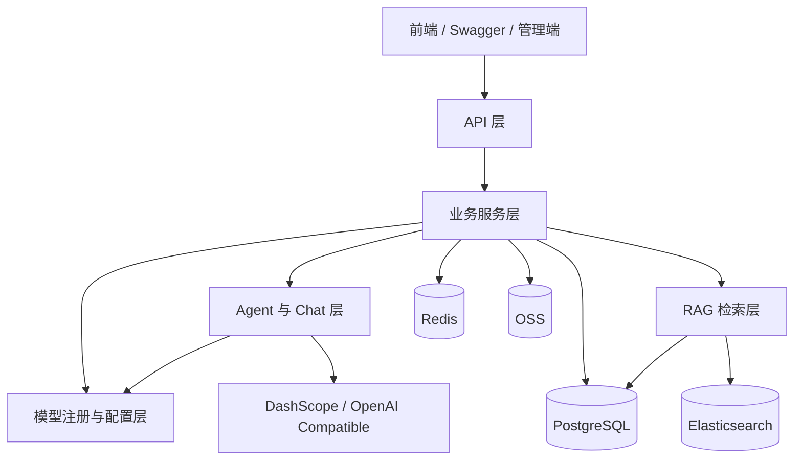

# 后端设计文档

> 本文档用于描述当前后端系统的稳定设计基线。
> 
> 不在本文档维护的内容：详细需求、接口逐条说明、阶段性实施方案、问题修复记录、一次性迁移步骤。

---

## 1. 文档定位

本文档关注以下内容：

- 系统边界与核心职责划分
- 核心模块之间的协作关系
- 关键数据模型与持久化策略
- 当前后端的主要技术约束

本文档不作为以下内容的唯一来源：

- 需求基线：见 `docs/SRS.md`
- 接口明细：见 Swagger / OpenAPI
- 阶段性规划与实施记录：见 `docs/stage/`

---

## 2. 技术基线

### 2.1 核心技术栈

| 类别 | 选型 |
|:---|:---|
| 应用框架 | Spring Boot 3.4.4 |
| 运行时 | Java 21 |
| AI 框架 | Spring AI 1.1.2 |
| AI 扩展 | Spring AI Alibaba 1.1.2.2、spring-ai-openai |
| 持久化 | Spring Data JPA + JdbcTemplate |
| 关系数据库 | PostgreSQL |
| 向量能力 | pgvector |
| 检索增强 | Elasticsearch + PGVector 混合检索 |
| 缓存 | Redis |
| 对象存储 | 阿里云 OSS |
| 接口文档 | SpringDoc OpenAPI / Swagger |

### 2.2 当前设计特点

- 业务主数据以 PostgreSQL 为准
- 结构化业务实体以 JPA 管理
- 聊天会话与聊天消息当前使用 JdbcTemplate 管理
- RAG 检索采用向量检索与关键词检索并行召回、融合排序
- 对话模型支持多模型配置与按会话选择
- Agent 执行过程与检索过程具备可观测性接口

---

## 3. 系统架构



### 3.1 分层职责

| 层级 | 职责 |
|:---|:---|
| API 层 | 提供统一 HTTP 入口，负责参数接收、权限校验、租户上下文接入、响应封装 |
| 业务服务层 | 承载用户、租户、文档、对话、测验、模型管理等业务编排 |
| Agent 与 Chat 层 | 负责基于模型与工具链执行智能问答和智能测验 |
| RAG 检索层 | 负责文档切分、向量检索、关键词检索、融合排序与降级 |
| 持久化与基础设施层 | 负责 PostgreSQL、Elasticsearch、Redis、OSS、外部模型服务接入 |

### 3.2 设计原则

- API 层不承载复杂业务规则
- 业务规则集中在 Service 与 Agent 相关组件
- 主流程优先保证可用性，外部能力异常时允许有限降级
- 多租户隔离优先于局部实现便利
- 架构文档只保留稳定设计，不保留一次性实现痕迹

---

## 4. 核心模块设计

### 4.1 用户与租户模块

职责：

- 用户注册、登录、资料维护
- 个人租户与团队租户管理
- 当前活跃租户切换
- 权限边界控制

设计约束：

- 绝大多数业务查询必须带租户上下文
- 管理员能力与普通用户能力严格区分
- 用户头像走 OSS 前端直传，后端只负责签发和元数据更新

### 4.2 文档与知识库模块

职责：

- 文档上传、存储、删除、重建索引
- 文档切分、向量化、关键词索引同步
- 维护租户隔离的知识库语义检索能力

设计约束：

- 原始文档与索引处理解耦
- 文档入库与索引更新允许异步执行
- 检索链路支持降级，避免单一检索源故障导致主流程不可用

### 4.3 对话与 RAG 模块

职责：

- 会话创建、历史消息管理、上下文对话
- 根据会话绑定的模型执行聊天
- 基于知识库进行 RAG 问答
- 提供同步与 SSE 流式输出能力

设计约束：

- `ChatSession` 持久化模型选择结果，后续对话沿用同一 `modelId`
- 模型能力通过注册中心统一解析，不由业务代码直接拼装模型实例
- 会话消息与检索链路需支持可观测性追踪

### 4.4 AI 模型管理模块

职责：

- 维护模型配置、启停状态、展示信息和访问方式
- 为对话和 Agent 提供统一模型解析能力

设计约束：

- 模型配置以 `ai_model_config` 为核心
- OpenAI 兼容模型密钥必须加密存储
- 默认模型可作为兜底，但不应在业务代码中写死多套切换逻辑

### 4.5 智能测验模块

职责：

- 组织测验会话、题目生成、答题提交与结果分析
- 维护知识掌握状态与知识缺口
- 基于 Agent 实现动态出题与反馈

设计约束：

- 测验流程不是固定题量流程，而是围绕知识掌握状态动态推进
- 会话状态、题目、回答、知识状态、执行日志分层存储
- Agent 决策、工具调用和评估结果需要留痕

### 4.6 可观测性模块

职责：

- 提供 Agent 执行时间线、工具统计、RAG 轨迹查看能力
- 支撑联调、排障和效果分析

设计约束：

- 可观测性属于支撑能力，不应侵入主业务模型
- 以查询接口和日志实体为主，不将调试逻辑混入核心流程

---

## 5. 数据设计

### 5.1 持久化策略

| 数据类型 | 持久化方式 |
|:---|:---|
| 用户、租户、文档、模型配置、测验相关实体 | JPA + PostgreSQL |
| 聊天会话、聊天消息 | JdbcTemplate + PostgreSQL |
| 向量片段 | Spring AI VectorStore + PostgreSQL / pgvector |
| 关键词索引 | Elasticsearch |
| 临时状态与缓存 | Redis |
| 文件对象 | OSS |

### 5.2 核心数据域

| 数据域 | 关键对象 |
|:---|:---|
| 身份与权限 | `user`、`tenant`、`tenant_user` |
| 文档与知识库 | `study_friend_document`、`study_friends` |
| 对话 | `chat_session`、`chat_message` |
| 模型配置 | `ai_model_config` |
| 测验 | `quiz_session`、`quiz_question`、`question_response` |
| 学习状态 | `user_knowledge_state`、`unmastered_knowledge` |
| 可观测性 | `agent_execution_log` 及相关轨迹数据 |

### 5.3 数据建模原则

- 业务主表统一考虑租户隔离与逻辑删除
- JPA 实体统一使用清晰的时间字段与状态字段
- 结构稳定的复杂字段优先强类型建模
- 结构变化较大的上下文数据允许使用 JSONB
- 不将检索索引作为唯一数据源，关系库始终为主数据源

### 5.4 JPA 与非 JPA 的边界

- 测验相关实体、模型配置、用户租户等结构化业务数据使用 JPA
- 聊天会话与消息当前保持 JdbcTemplate 方式，避免在现阶段强行统一带来额外改造成本
- 该边界是当前实现现状，也是当前设计基线的一部分

---

## 6. 关键业务流

### 6.1 RAG 对话流程

```text
用户发起对话
→ 创建或读取会话
→ 解析会话绑定的模型
→ 执行向量检索与关键词检索
→ 融合召回结果
→ 组织上下文并调用模型
→ 返回同步结果或 SSE 流式结果
→ 持久化消息与相关追踪信息
```

### 6.2 文档索引流程

```text
用户上传文档
→ 保存文档元数据与原始文件
→ 异步切分与向量化
→ 写入 PGVector
→ 同步关键词索引到 Elasticsearch
→ 更新文档状态
```

### 6.3 智能测验流程

```text
创建测验会话
→ Agent 基于知识范围生成题目
→ 用户提交答案
→ 评估答案并更新知识状态
→ 判断是否继续出题 / 补漏 / 结束
→ 输出结果与分析数据
```

---

## 7. 关键技术约束

### 7.1 租户隔离

- 文档、对话、测验、可观测数据均应受租户约束
- 非管理员接口默认只允许访问当前租户上下文内的数据

### 7.2 可用性与降级

- 外部模型服务不可用时，错误应在调用边界清晰暴露
- Elasticsearch 异常时，检索流程应尽量退化为可继续执行的模式
- 可观测性能力失败不能阻断主业务流程

### 7.3 安全性

- 模型密钥、对象存储密钥等敏感信息不得明文存储在业务数据中
- 文件上传必须限制作用域、路径和大小
- 管理接口必须与普通业务接口明确分层

### 7.4 演进边界

- 需求变化优先通过新增模块能力或扩展配置解决，不直接破坏现有主流程边界
- 阶段性方案在 `docs/stage/` 维护，不再回填到本设计文档
- 已上线的稳定设计优先保持兼容，避免将实验性实现写入基线文档

---

## 8. 文档边界

为避免文档重复，当前约定如下：

| 文档 | 作用 |
|:---|:---|
| `docs/SRS.md` | 唯一需求规格说明 |
| `docs/后端设计文档.md` | 唯一后端设计基线 |
| `docs/stage/*.md` | 阶段性规划、迁移、联调、问题记录 |
| Swagger / OpenAPI | 接口级明细与调试入口 |

后续若出现新的阶段性实现说明，不再直接扩充到本文件，而是单独放入 `docs/stage/`，仅在本文件保留稳定设计结论。
